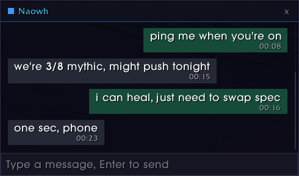

# Whispy

## TL;DR

- whispers, regular and bnet
- but in windows, one per person, bubbles
- keeps history, per conversation
- WIM replacement/clone: yes

## What it actually is

Whispy is a World of Warcraft addon that pulls whispers out of the chat frame and into proper conversation windows — one window per person, messages laid out as bubbles, and a full history that survives reloads and logouts. Instead of hunting for a whisper that scrolled past three pulls ago, you get a window per conversation that remembers everything that was said in it.

It handles both regular and BattleNet whispers, follows every route the game uses to start a whisper (`/w`, clicking a name in chat, the unit menu), and stays out of your way in combat.

## Features

- **A window per conversation** — whispers open a dedicated window with the other player's name, class colour, and a status dot in the header, instead of scrolling past in the chat frame
- **Chat-bubble layout** — your lines sit right and green, theirs left and grey, each with a timestamp, and the bubbles re-flow when you resize the window
- **Persistent history** — every conversation is stored per character (200 lines by default) and replayed into the window the next time you open it, with date dividers between days
- **Day dividers** — a centred "Today" or full date separates messages that fall on different days
- **BattleNet support** — real-ID whispers get their own windows, resolved to the account name and coloured blue
- **Whisper interception** — starting a whisper any way the game allows (`/w <name>`, clicking a name in chat, unit menu → Whisper) opens a focused Whispy window and dismisses the default edit box
- **One conversation per player** — `Bob` and `Bob-YourRealm` resolve to the same window instead of two, so cross-realm names never split a conversation in half
- **Shift-click linking** — drop item, spell, quest, and achievement links into a Whispy window from bags, the character sheet, tooltips, the quest log, anywhere — the game's own edit boxes and search fields still get first claim on the link
- **Live hyperlinks in messages** — links inside bubbles show their tooltip on hover and open on click, exactly like the default chat
- **AFK / DND replies** — auto-replies from someone you whispered appear as a system line in their conversation, but only if the window already exists
- **Combat-aware** — windows hide when you enter combat, reappear when you leave, and whispers that arrive mid-fight are queued rather than dropped
- **Minimap button** — left-click for a recent-chats flyout, right-click for the full scrollable chat list, drag to reposition around the minimap
- **Chat list with previews** — every stored conversation, newest first, with a class-coloured name, a relative timestamp (`now`, `5m`, `3h`, `2d`), and a preview of the last line
- **Resizable, movable, remembered** — drag by the header, resize by the grip, and the size and last position carry over to the next window you open
- **Flat blue/dark UI** — a single palette drives every frame, with a thin custom scrollbar and no Blizzard chrome
- **Sound and flash on incoming** — an optional whisper sound plus a taskbar flash when the window isn't already under your cursor
- **Screenshot mode** — swaps your real chats for a generated sample set so you can capture the UI without leaking private conversations; your data is restored on toggle-off and on logout, and the samples never reach SavedVariables
- **Demo mode** — `/whispy test` plays a short scripted conversation locally so you can see the layout without waiting for someone to whisper you

## Screenshots

## Slash commands

| Command | Effect |
|---|---|
| `/whispy` or `/whispy help` | List every command |
| `/whispy <name>` | Open a whisper window for that player |
| `/whispy chats` or `/whispy all` | Toggle the full chat list |
| `/whispy list` | Print the currently open conversations |
| `/whispy toggle` | Enable/disable routing whispers into Whispy |
| `/whispy sound` | Toggle the incoming-whisper sound |
| `/whispy minimap` | Show or hide the minimap button |
| `/whispy clear <key>` | Clear the stored history for one conversation |
| `/whispy clearall` | Wipe all stored history |
| `/whispy test` | Play a simulated demo conversation (nothing is sent) |
| `/whispy sim <name> <text>` | Inject one fake incoming whisper |
| `/whispy screenshot` or `/whispy ss` | Toggle screenshot/presentation mode |

Turning routing off (`/whispy toggle`) hands whispers straight back to the default chat frame — nothing is suppressed and no windows open.

## Localization

English. Every user-visible string lives in one table (`ns.strings` in `Core.lua`), and translations drop into `ns.locales[<locale>]` without touching the rest of the addon.

## Changelog

See [CHANGELOG.md](CHANGELOG.md) for the notable changes in each release.
